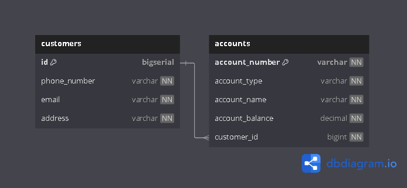

# Shop RESTful API

This is a RESTful API for a simple shop management system built using the Spring Boot framework. It provides customer and account management functionality, allowing users to create, update, retrieve, and delete customers and accounts.

## Technologies Used
- **Spring Boot**: Framework for building the RESTful API.
- **Spring Web MVC**: For handling HTTP requests and routing.
- **Spring Data JPA**: For data persistence and interaction with the MySQL database.
- **MySQL**: Relational database for storing customer and account data.
- **Validation**: To validate input data for API requests.
- **Lombok**: To reduce boilerplate code by generating getter, setter, and other methods.

## Features
The API provides the following main features:
- **Customer Management**: Manage customer data including creation, updating, retrieval, and deletion.
- **Account Management**: Manage customer account data including account creation, updating, retrieval, and deletion.

## Entity Relational Diagram


## Project Structure

The project follows a layered architecture, with packages divided by their functionality. The main structure is organized as follows:

```
src
└── main
    └── java
        └── com
            └── wide
                └── simple_restful_api
                    ├── controller
                    │   ├── AccountController.java
                    │   ├── CustomerController.java
                    │   └── ErrorController.java
                    │
                    ├── entity
                    │   ├── Account.java
                    │   └── Customer.java
                    │
                    ├── model
                    │   ├── AccountResponse.java
                    │   ├── CustomerResponse.java
                    │   ├── PagingResponse.java
                    │   └── WebResponse.java
                    │
                    ├── model
                    │   └── dto
                    │       ├── CreateAccountRequest.java
                    │       ├── CreateCustomerRequest.java
                    │       ├── PagingCustomerRequest.java
                    │       ├── UpdateAccountRequest.java
                    │       └── UpdateCustomerRequest.java
                    │
                    ├── repository
                    │   ├── AccountRepository.java
                    │   └── CustomerRepository.java
                    │
                    └── service
                        ├── AccountService.java
                        └── CustomerService.java
```

### Package Overview

- **controller**:
    - `AccountController`: Handles HTTP requests related to account management.
    - `CustomerController`: Manages customer-related HTTP requests.
    - `ErrorController`: Global exception handler to manage errors gracefully.

- **entity**:
    - `Account`: Entity class representing an account in the database.
    - `Customer`: Entity class representing a customer in the database.

- **model**:
    - `AccountResponse`: Defines the structure of account responses.
    - `CustomerResponse`: Defines the structure of customer responses.
    - `PagingResponse`: Provides paging details for paginated results.
    - `WebResponse`: Wrapper for standardized JSON responses.

- **model.dto**:
    - `CreateAccountRequest`: Data Transfer Object (DTO) for creating a new account.
    - `CreateCustomerRequest`: DTO for creating a new customer.
    - `PagingCustomerRequest`: DTO for requesting paginated customer lists.
    - `UpdateAccountRequest`: DTO for updating account information.
    - `UpdateCustomerRequest`: DTO for updating customer information.

- **repository**:
    - `AccountRepository`: Repository interface for CRUD operations on accounts.
    - `CustomerRepository`: Repository interface for CRUD operations on customers.

- **service**:
    - `AccountService`: Business logic for managing accounts.
    - `CustomerService`: Business logic for managing customers.

## Getting Started

### Prerequisites

- Java 11 or higher
- Maven
- MySQL database
- Spring Boot

### Setup

1. **Clone the repository**:
   ```bash
   git clone https://github.com/Wordyka/Shop-RESTful-API.git
   cd simple_restful_api
   ```

2. **Configure MySQL database**:
   Update the `application.properties` file with your MySQL configuration:
   ```properties
   spring.application.name=Simple Spring RESTful API
   spring.datasource.driver-class-name=com.mysql.cj.jdbc.Driver
   spring.datasource.username=<username>
   spring.datasource.password=<password>
   spring.datasource.url=jdbc:mysql://localhost:3306/shop_db
   spring.datasource.type=com.zaxxer.hikari.HikariDataSource
   spring.datasource.hikari.minimum.idle=10
   spring.datasource.hikari.maximum-poll-size=50
   server.port=8090
   spring.jpa.properties.hibernate.format_sql=true
   spring.jpa.properties.hibernate.show_sql=true
   spring.jpa.hibernate.naming.implicit-strategy=org.hibernate.boot.model.naming.ImplicitNamingStrategyLegacyJpaImpl
   spring.jpa.hibernate.naming.physical-strategy=org.hibernate.boot.model.naming.PhysicalNamingStrategyStandardImpl
   ```

3. **Build and Run the application**:
   ```bash
   mvn clean install
   mvn spring-boot:run
   ```

4. **API Documentation**:
   After starting the server, access the API endpoints at `http://localhost:8080/api`.

## API Endpoints

### Customer Management
- `POST /api/customers`: Create a new customer
- `GET /api/customers/{id}`: Retrieve customer details by ID
- `PUT /api/customers/{id}`: Update customer information
- `DELETE /api/customers/{id}`: Delete a customer
- `GET /api/customers`: List all customers with pagination

### Account Management
- `POST /api/customers/{customerId}/accounts`: Create a new account for a customer
- `GET /api/customers/{customerId}/accounts/{accountNumber}`: Retrieve account details by account number
- `PUT /api/customers/{customerId}/accounts/{accountNumber}`: Update account details
- `DELETE /api/customers/{customerId}/accounts/{accountNumber}`: Delete an account
- `GET /api/customers/{customerId}/accounts`: List all accounts for a specific customer

## Error Handling

The `ErrorController` provides global exception handling for:
- **Validation Errors**: Returns `400 Bad Request` when input validation fails.
- **Custom API Errors**: Returns specific HTTP status codes for exceptions thrown in the application.
